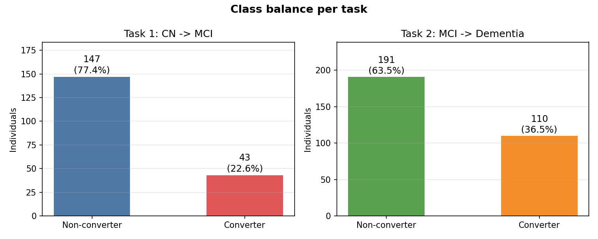
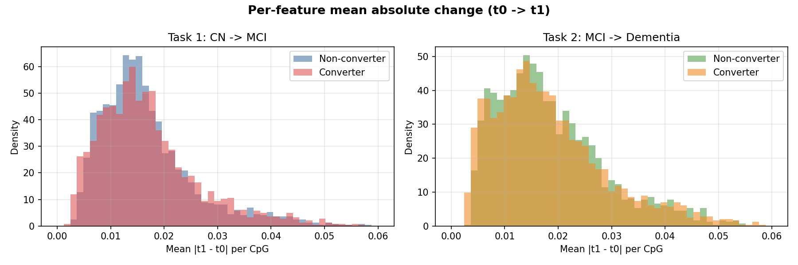
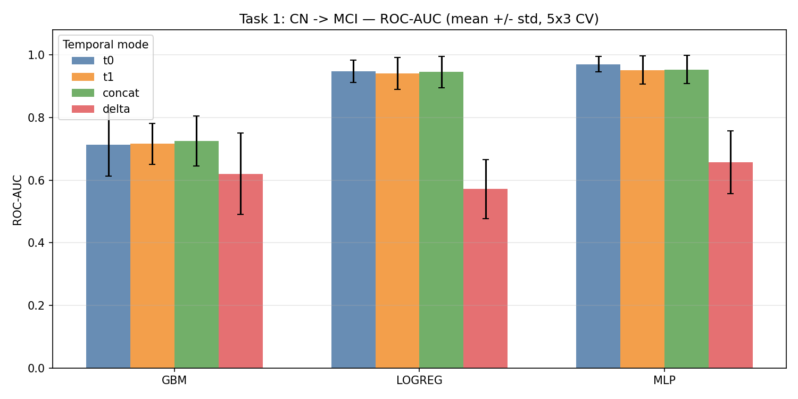
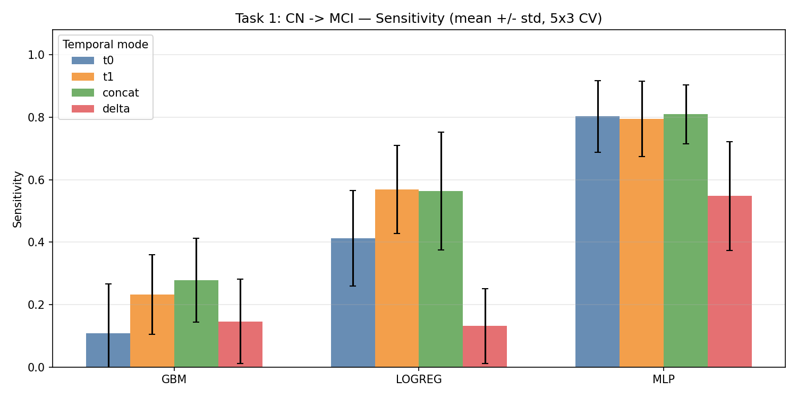
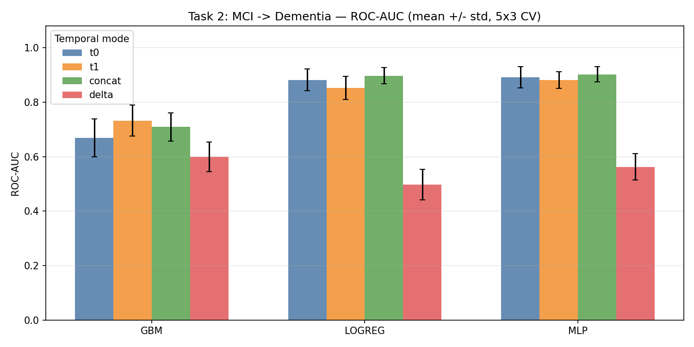

# Epiome AI - Take home task

### 1. Task definition

The goal is to predict whether an individual will progress in their Alzheimer's disease status based on peripheral blood DNA methylation data. This is structured as two independent binary classification problems:

- **Task 1:** Given a methylation profile from a cognitively normal (CN) individual, predict whether they will later be diagnosed with Mild Cognitive Impairment (MCI).
- **Task 2:** Given a methylation profile from an MCI individual, predict whether they will later progress to dementia.

These are treated as independent tasks because the populations, feature panels, class distributions, and clinical questions differ between them. A single multi-state model would conflate these distinctions without obvious benefit at this sample size.

### 1.1 Prediction target

Each individual is assigned a binary label:

- `0` = non-converter (status is stable across the observation window)
- `1` = converter (individual progresses to the next diagnostic stage)

Labels are determined by group membership in the HDF5 file rather than being derived from raw trajectory data. The file partitions individuals into four pre-defined groups: `X_cn_to_cn`, `X_cn_to_mci`, `X_mci_to_mci`, `X_mci_to_dem`. This means the label construction decisions - which visits to use, how to handle reversion, how to define conversion - were made upstream by the data provider. This simplifies the modelling pipeline considerably and removes ambiguity around edge cases, but it also means that reported performance is conditional on the data provider's labelling choices.

### 2. Most influential EDA findings

**Finding 1 — Exactly 2 timepoints per individual, not variable-length sequences.**  
- Task 1: 190 individuals (147 non-converter, 43 converter) — 22.6% positive rate.  
- Task 2: 301 individuals (191 non-converter, 110 converter) — 36.5% positive rate.  
- Fixed T = 2 rules out any need for padding/masking and makes sequence models unwarranted.

**Finding 2 — Class imbalance requires deliberate metric and training choices.**  

- Task 1 at 22.6% and Task 2 at 36.5% means a naive all-negative model achieves 77.4% accuracy. Accuracy is meaningless.  
- PR-AUC is the primary metric: it focuses on both precision (fraction of correctly predicted converters) and recall (measures the fraction of true converters identified). ROC-AUC inflates via true negatives when negatives dominate.  
- Sensitivity is reported separately: missing a true converter (FN) has higher clinical cost than a false alarm.

**Finding 3 — Methylation is nearly identical across the two visits.**  

- Within-individual Pearson r ≥ 0.998 (median) across all four groups.  
- Mean absolute change per CpG ≈ 0.015–0.020 on the [0, 1] beta scale.  
- Delta distributions for converters and non-converters are visually indistinguishable.  
- Prediction → the delta temporal mode will carry no discriminative signal. Confirmed empirically.

### 3. Decisions that fell out from the EDA

**Temporal representation** (report §3.1–3.2)  

The dataset has exactly T = 2 time points per individual and r = 0.998. Initial plans included a temporal transformer to model the visit sequence however after inspection of the data attention reduces to a single scalar weight — no multi-step dependency exists. 

A more useful question given tT = 2 is **does the change or the level carry the signal?**

This is better answered by four explicit temporal input modes:

| Mode | Representation | Clinical question answered |
|---|---|---|
| t0 | Baseline methylation (2,000 features) | Can level at first visit predict conversion? |
| t1 | Follow-up methylation (2,000 features) | Is the later visit more informative? |
| concat | t0 ∥ t1 (4,000 features) | Do both timepoints together add up? |
| delta | t1 − t0 (2,000 features) | Does rate of change carry signal? |

This is a transparent ablation that directly answers the longitudinal information question rather than hiding it in a learned weight.

**Validation strategy** (report §3.3)  
A single holdout was rejected: 43 converters × 20% hold-out ≈ 8–9 positives, far too few for stable AUC estimates. 
Used **5-fold repeated stratified CV, 3 repeats (15 folds total)**. Stratification is essential to preserve class ratio in each fold — a fold with zero converters cannot produce a valid AUC (extremely high variance). Individual-level split (train/val) is equivalent here since each individual has exactly one row. Managed this using assertions (no index appears in both train and validation sets in any fold)!

**Model ladder** (report §3.2)  
- **Logistic regression (L2, balanced weights):** primary baseline; well-suited to the high-D, low-N regime. L2 used as it shrinks highly correlated features together rather than zeroing them out. Handled class imbalance using 'class weight = balanced'
- **HistGradientBoosting (balanced weights):** nonlinear tabular check; expected to overfit — included to confirm.Handled class imbalance using 'class weight = balanced'
- **MLP (2000 → 256 → 64 → 1, BatchNorm, Dropout 0.4, AdamW, early stopping):** compact neural baseline, with strong regularisation (DrpOut and Weight decay and early stopping on validation loss), kept small given dataset

Class imbalance handled via loss weighting not resampling: SMOTE with 43 converters creates artificial redundancy from the same sparse minority; undersampling discards already-scarce majority data.

### 4. End-end pipeline
> 1. **Load** — `src/data.py` (or `src/datasets/adni.py`) reads the HDF5 and returns X as (N, T, D) and y as (N,) per task.  
> 2. **Temporal mode** — `src/preprocessing.py` computes the requested representation (t0, t1, concat, or delta) from the (N, T, D) array, giving (N, D') where D' is 2,000 or 4,000.  
> 3. **CV split** — `src/splits.py` generates 15 stratified folds (5-fold × 3 repeats) from (N, D'). A leakage assertion checks no index overlaps.  
> 4. **Per-fold preprocessing** — StandardScaler fitted on training split, applied to validation split.  
> 5. **Train** — `src/train_sklearn.py` or `src/train_torch.py` trains the model on the fold's training data with class-weighted loss.  
> 6. **Evaluate** — model predicts probabilities on the validation fold; metrics are computed and stored.  
> 7. **OOF predictions** — each fold's validation predictions are concatenated into a full out-of-fold prediction file (`outputs/predictions/*.csv`).  
> 8. **Aggregate** — mean ± std across 15 folds is written to `outputs/metrics/*.json`.  
> 9. **Visualise** — `src/evaluate.py` loads all OOF CSVs and produces ROC curves, PR curves, and comparison bar charts.  

### 5. Results — headline numbers

The delta prediction was confirmed. Logistic regression was a strong baseline. The MLP improved substantially on sensitivity.

**Task 1 (CN → MCI) — best results per model:**

| Model | Mode | ROC-AUC | PR-AUC | Sensitivity |
|---|---|---|---|---|
| Logistic regression | t0 | 0.948 ± 0.036 | 0.879 ± 0.078 | 0.413 ± 0.152 |
| Logistic regression | t1 | 0.941 ± 0.051 | 0.891 ± 0.088 | 0.569 ± 0.141 |
| GBM | concat | 0.725 ± 0.079 | 0.528 ± 0.124 | 0.279 ± 0.135 |
| **MLP** | **t0** | **0.970 ± 0.025** | **0.926 ± 0.054** | **0.803 ± 0.115** |
| (delta, any model) | — | ~0.57–0.66 | ~0.39–0.46 | — |

**Task 2 (MCI → Dementia) — best results per model:**

| Model | Mode | ROC-AUC | PR-AUC | Sensitivity |
|---|---|---|---|---|
| Logistic regression | concat | 0.897 ± 0.029 | 0.870 ± 0.038 | 0.664 ± 0.083 |
| GBM | t1 | 0.733 ± 0.056 | 0.624 ± 0.078 | 0.409 ± 0.094 |
| **MLP** | **concat** | **0.902 ± 0.028** | **0.875 ± 0.038** | **0.770 ± 0.071** |
| (delta, any model) | — | ~0.50–0.56 | ~0.39–0.44 | — |

Key takeaways:
1. Delta is consistently uninformative — confirms the EDA prediction.
2. Logistic regression beats GBM substantially in this regime (high-D, low-N).
3. MLP's main gain over logistic regression is **sensitivity**, not ROC-AUC. The discrimination gap is small; the recall gap is large. This is a threshold/calibration story (see Q&A §Results).
4. Adding t1 to t0 (concat) offers modest but real gains on Task 2; on Task 1, t0 alone is effectively optimal.
5. All numbers are **optimistically biased** by pre-selection leakage (see §5).

### 6. Limitations

The most important limitation is the one baked in from the start. (report §2.2 and §5.4)

**Feature pre-selection leakage.** The 2,000 CpGs were selected using variance ratio between converters and non-converters on the **full dataset**. This encodes label information before any train/test split. All reported AUCs are optimistically inflated by an unknown amount. Fold-wise reselection is not possible without the full CpG matrix. Relative comparisons between models and temporal modes are still valid; **absolute AUC values should not be taken as estimates of real-world performance**.

Other honest gaps: no clinical covariates (APOE ε4, age, sex), no cell-type deconvolution for blood methylation confounding, no batch correction (no metadata provided), all evaluation within ADNI (known selection characteristics — older, educated, predominantly white).

### 7. What I'd do next (~1 min)

_"In priority order by expected return:"_

1. **Fix model registry to match dataset registry**: already completed this after submission.
1. **Fold-wise feature reselection** — would give an unbiased performance estimate. Highest-impact fix.
2. **Clinical covariates** — APOE ε4 alone is a strong independent predictor; its absence is also a confounding risk.
3. **Survival analysis** — time-to-conversion rather than binary label captures more clinical information.
4. **External validation** — ROSMAP or AIBL to test whether signals transfer out of ADNI.
5. **Temporal models at scale** — dataset interface already returns (N, T, D), ready for an RNN/transformer if data scale grows.

